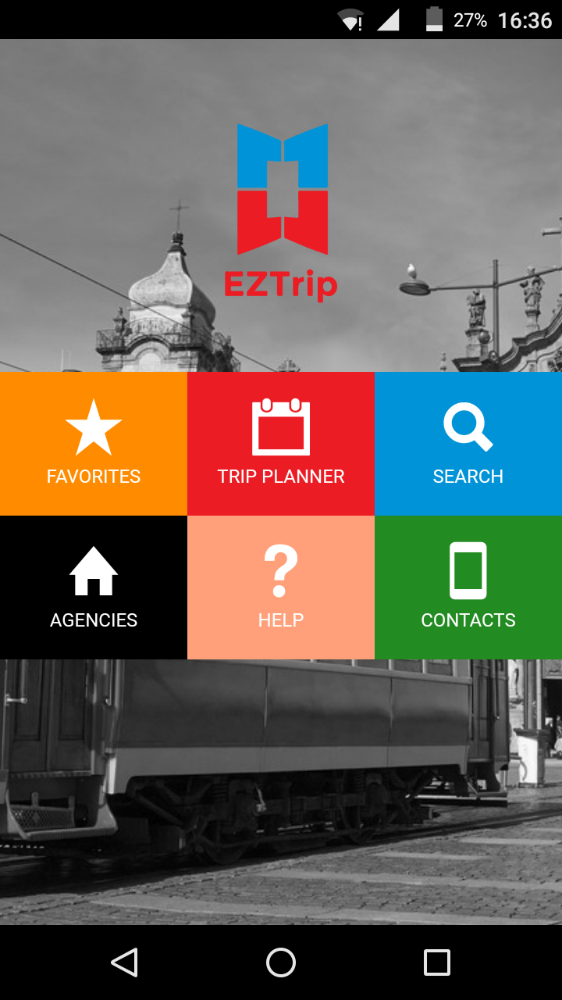
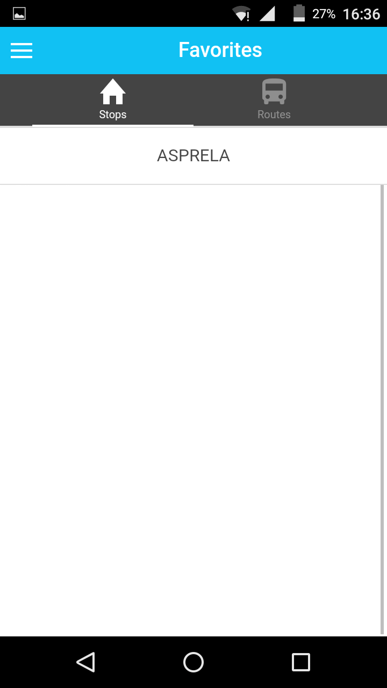
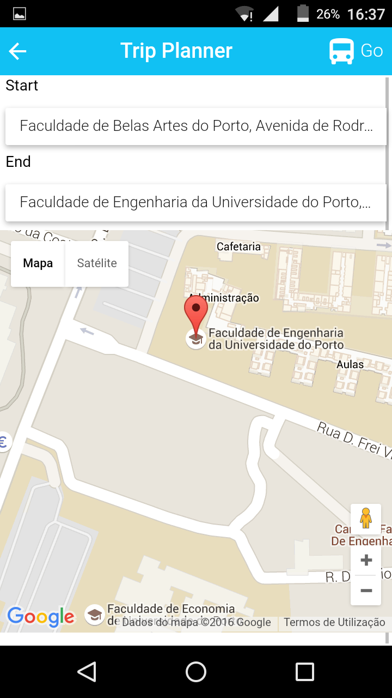
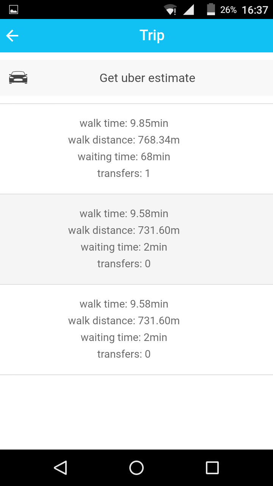
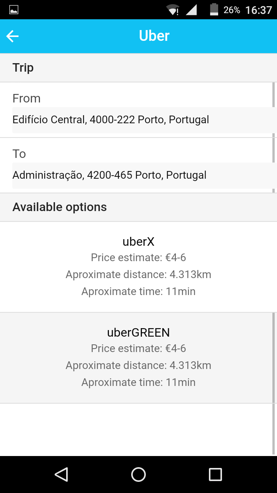
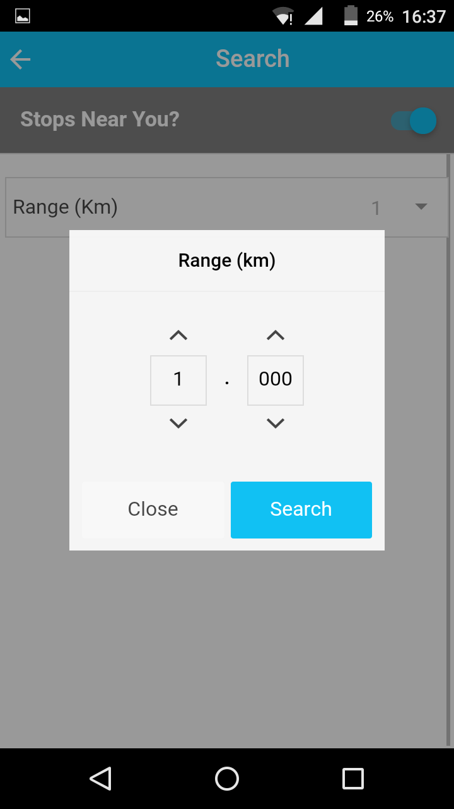
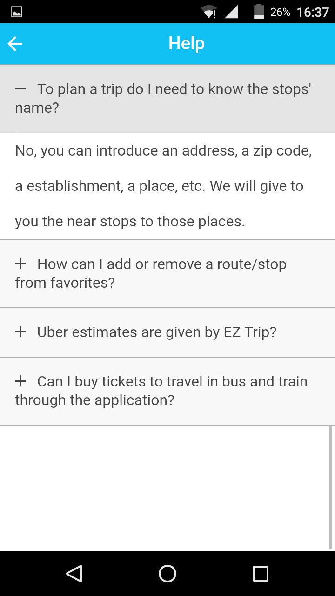
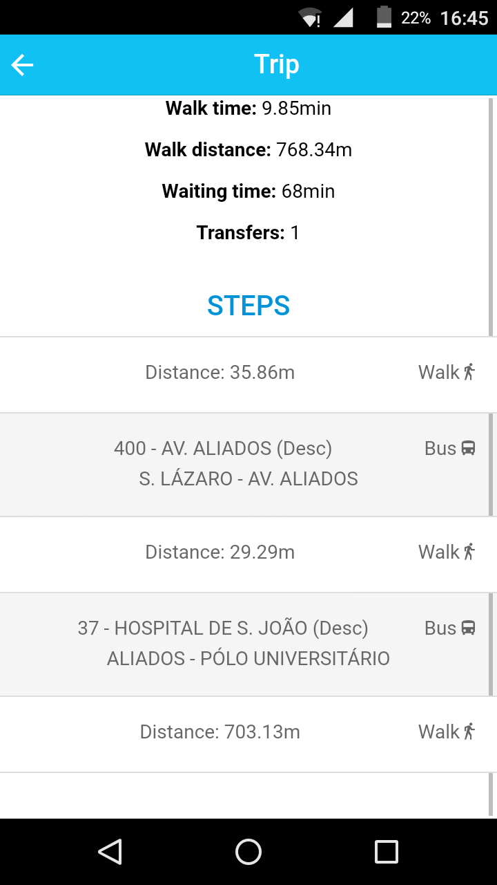

# EZTrip
Android, iOS app and website developed in AngularJS using Ionic framework.

Trip planning in Porto, Portugal.

This project uses OST API, Google Maps API and Uber API.

# Screenshots

